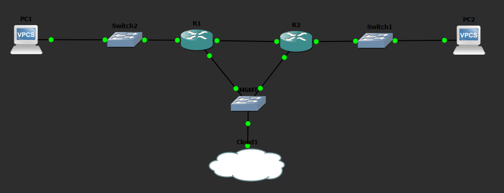

# basic-network-automation-lab

A GNS3 home lab simulating a small office network with Python automation using Netmiko.

## Topology

```
[PC1] --- [SW2] --- [R1] ---OSPF--- [R2] --- [SW1] --- [PC2]
      192.168.1.0/24   10.0.0.0/30    192.168.2.0/24
                            |
                       [SW-MGMT]
                            |
                       [Cloud/eth1]
                            |
                    Laptop (192.168.221.1)
```

## Devices

- 2 x Cisco 3725 Routers (R1, R2)
- 3 x Cisco L2 Switches (SW1, SW2, SW-MGMT)
- OSPF routing between routers
- SSH version 2 enabled on all routers

## Automation Scripts

### network_[automation.py](https://github.com/sonnyx96/basic-network-automation-lab/blob/main/network_automation.py)

SSHs into both routers and pulls interface status using `show ip interface brief`.

### backup_[configs.py](https://github.com/sonnyx96/basic-network-automation-lab/blob/main/backup_configs.py)

SSHs into both routers, pulls the full running config, and saves timestamped backup files locally.

Example output:

```
Connecting to R1...
Interface              IP-Address      OK? Method Status Protocol
FastEthernet0/0        10.0.0.1        YES manual up     up
FastEthernet0/1        192.168.1.1     YES manual up     up
FastEthernet1/0        192.168.221.2   YES manual up     up

Connecting to R2...
Interface              IP-Address      OK? Method Status Protocol
FastEthernet0/0        10.0.0.2        YES manual up     up
FastEthernet0/1        192.168.2.1     YES manual up     up
FastEthernet1/0        192.168.221.3   YES manual up     up
```

## Tools Used

- GNS3 with VMware
- Cisco IOS (c3725)
- Cisco IOU L2 Switch
- Python 3
- Netmiko

## Skills Demonstrated

- GNS3 lab setup and device configuration
- OSPF dynamic routing
- SSH security configuration on Cisco IOS
- Python scripting with Netmiko
- Automated config backup with timestamping
